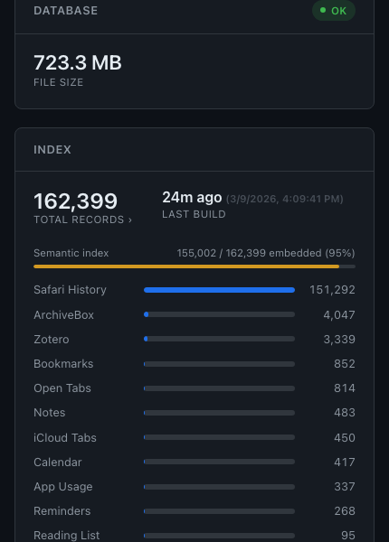
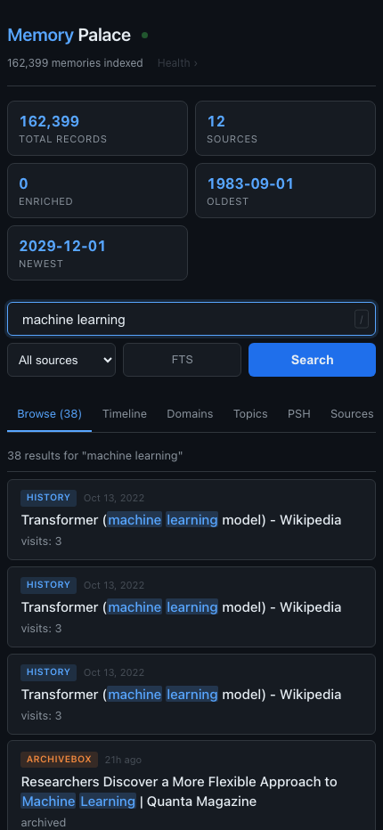

# Memory Palace

A personal knowledge indexer for macOS. Pulls your browsing history, bookmarks,
notes, calendar, reminders, Zotero library, and more into a single SQLite database
with full-text search and a local web UI.

<p align="center">
  
  
</p>

## Contents

- [What it indexes](#what-it-indexes)
- [Requirements](#requirements)
- [Build](#build)
- [Usage](#usage)
- [Web UI](#web-ui)
- [Running as a launchd service](#running-as-a-launchd-service)
- [Zotero integration](#zotero-integration)
- [ArchiveBox integration](#archivebox-integration)
- [Data](#data)
- [Database schema](#database-schema)
- [Privacy](#privacy)

---

## What it indexes

| Source | What gets captured |
|---|---|
| Safari History | URL, title, visit timestamp |
| Safari Bookmarks | URL, title |
| Safari Reading List | URL, title, added date |
| Safari Open Tabs | URL, title |
| Safari iCloud Tabs | URL, title, device |
| Calendar | Event title, date, notes, location |
| Reminders | Title, due date, notes |
| Notes | Title, body text |
| Zotero | Title, URL, abstract, tags |
| ArchiveBox | Archived URL, title, snapshot date |
| KnowledgeC | App usage events |

All data stays on your machine. Nothing leaves without your explicit action.

---

## Requirements

- macOS 13+ (Ventura or later)
- Go 1.22+
- Full Disk Access granted to the binary in System Settings → Privacy & Security → Full Disk Access
  (required to read Safari and Apple system databases)

Optional:
- Zotero desktop app (for Zotero indexing)
- ArchiveBox instance (local or remote via SSH/Incus)
- Kagi API key (for URL summarization enrichment)

---

## Build

```bash
git clone https://github.com/kashfshah/memory-palace
cd memory-palace
go build -o bin/memory-palace .
```

---

## Usage

### Index all sources

```bash
./bin/memory-palace
```

### Index specific sources

```bash
./bin/memory-palace --sources safari_history,safari_bookmarks,zotero
```

Available source names: `safari_history`, `safari_bookmarks`, `safari_reading_list`,
`safari_open_tabs`, `safari_icloud_tabs`, `calendar`, `reminders`, `notes`,
`zotero`, `archivebox`, `knowledgec`

### Search from the command line

```bash
./bin/memory-palace --query "rust async runtime"
```

### Show index statistics

```bash
./bin/memory-palace --stats
```

### Enrich URLs with Kagi Summarizer

```bash
KAGI_API_KEY=your_key ./bin/memory-palace --enrich --enrich-limit 50
```

Enrichment fetches a summary for each unprocessed URL and stores it in the index.
Summaries are included in full-text search.

### Sanitize blocked content

```bash
./bin/memory-palace --sanitize
```

Immediately removes records matching the built-in domain and keyword blocklist.
The same sanitization runs automatically after every index build.

---

## Web UI

```bash
./bin/memory-palace --serve --port 8484
```

Opens at `http://localhost:8484`. Features:

- Full-text search across all sources
- Timeline view (day / week / month granularity)
- Top domains
- Topic clusters
- PSH (Précis des Sciences Humaines) taxonomy browser
- `/health` dashboard — DB status, per-source record counts, live indexer status
- Real-time push via SSE — UI updates automatically when the index changes

### HTTPS + authentication

```bash
./bin/memory-palace --serve \
  --tls-cert certs/cert.pem \
  --tls-key certs/key.pem \
  --auth-user yourname \
  --auth-pass yourpassword
```

Basic auth credentials can also come from `MP_AUTH_PASS` env var.

---

## Running as a launchd service

Example plist for hourly indexing (adjust paths):

```xml
<?xml version="1.0" encoding="UTF-8"?>
<!DOCTYPE plist PUBLIC "-//Apple//DTD PLIST 1.0//EN"
  "http://www.apple.com/DTDs/PropertyList-1.0.dtd">
<plist version="1.0">
<dict>
  <key>Label</key>
  <string>com.yourname.memory-palace</string>
  <key>ProgramArguments</key>
  <array>
    <string>/path/to/memory-palace/bin/memory-palace</string>
    <string>--db</string>
    <string>/path/to/memory-palace/data/memory.db</string>
  </array>
  <key>StartInterval</key>
  <integer>3600</integer>
  <key>StandardOutPath</key>
  <string>/usr/local/var/log/memory-palace.log</string>
  <key>StandardErrorPath</key>
  <string>/usr/local/var/log/memory-palace.log</string>
</dict>
</plist>
```

Load it:

```bash
launchctl load ~/Library/LaunchAgents/com.yourname.memory-palace.plist
```

The web server runs as a separate plist that calls `--serve`. The server watches
`memory.db` for changes and pushes updates to connected browsers via SSE — no
TCC permissions needed for the server process.

---

## Zotero integration

Memory Palace reads directly from the Zotero SQLite database — no Zotero API
or sync required. It indexes title, URL, abstract, tags, and collection
membership from your local Zotero library.

Set `ZOTERO_DB` to your Zotero database path, or Memory Palace will search
the default location automatically:

```bash
# Default location (auto-detected)
~/Zotero/zotero.sqlite

# Override
ZOTERO_DB=/path/to/zotero.sqlite ./bin/memory-palace
```

### PSH taxonomy browser

If you run the PSH enrichment pipeline (`scripts/psh-classify.py`), Zotero
items get automatically classified into the
[Précis des Sciences Humaines](https://en.wikipedia.org/wiki/Pr%C3%A9cis_de_sciences_humaines)
taxonomy — a hierarchical classification of 14,000+ social science and
humanities concepts.

Classified items appear with PSH tag chips in search results and are
browsable via the **PSH** tab in the web UI (43 top-level sections, 700+
subcategories).

---

## ArchiveBox integration

Memory Palace supports reading from an ArchiveBox instance configured via
environment variables. Three modes:

| Mode | Env vars |
|---|---|
| Direct path | `ARCHIVEBOX_DB=/path/to/index.sqlite3` |
| SSH + rsync | `ARCHIVEBOX_SSH_HOST=myserver ARCHIVEBOX_SSH_PATH=/home/.../index.sqlite3` |
| Incus container | `ARCHIVEBOX_INCUS_CONTAINER=archivebox ARCHIVEBOX_INCUS_PATH=archivebox/home/.../index.sqlite3` |

Set these in a `.dev.vars` file in the project root (gitignored) or pass them
as environment variables to the indexer process.

### Feed new URLs to ArchiveBox

```bash
./bin/memory-palace --feed
./bin/memory-palace --feed --feed-batch 100 --dry-run
```

Diffs Memory Palace URLs against what ArchiveBox already has and submits the
difference. Checks disk space, load, and RAM on the ArchiveBox host before
submitting to avoid overloading it.

---

## Data

The database lives at `data/memory.db` by default (override with `--db`).
The `data/` directory is gitignored. Never commit it.

On each index run the database integrity runs a `PRAGMA quick_check`. A corrupt
database gets renamed to `memory.db.corrupt` and a fresh one gets created.

---

## Database schema

```sql
-- Primary store
CREATE TABLE memory (
    id        INTEGER PRIMARY KEY AUTOINCREMENT,
    source    TEXT NOT NULL,
    timestamp INTEGER NOT NULL,
    title     TEXT,
    url       TEXT,
    body      TEXT,
    summary   TEXT,        -- Kagi Summarizer output
    location  TEXT,
    raw_id    TEXT,
    UNIQUE(source, raw_id)
);

-- Full-text search
CREATE VIRTUAL TABLE memory_fts USING fts5(title, url, body, summary);

-- Build metadata
CREATE TABLE meta (key TEXT PRIMARY KEY, value TEXT);
```

---

## Privacy

Memory Palace runs entirely locally. No data leaves your machine except:

- Kagi Summarizer requests (opt-in, `--enrich` flag only) — sends URLs to Kagi
- Cloudflare Tunnel (opt-in) — if you configure remote access

The built-in sanitizer removes records matching a domain and keyword blocklist
on every index run. Add your own entries by editing `extractors/sanitize.go`.
